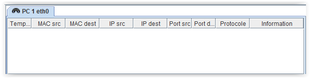
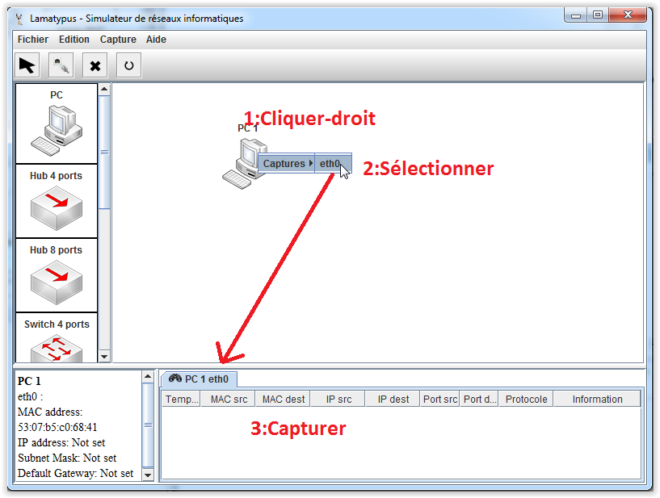
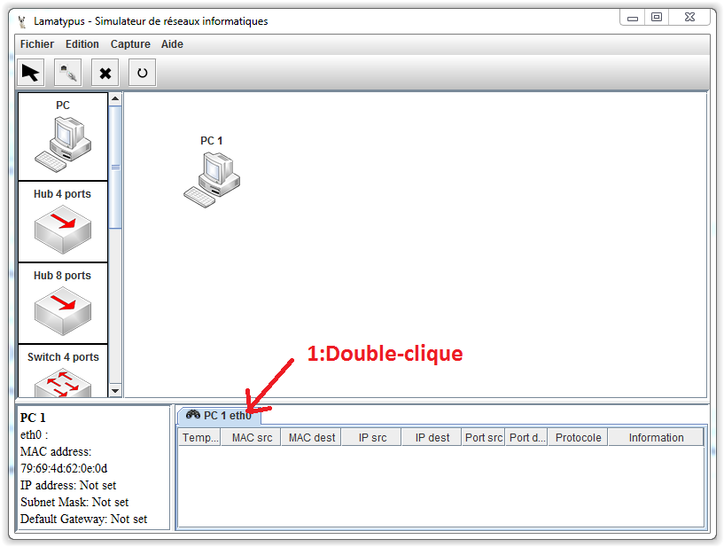
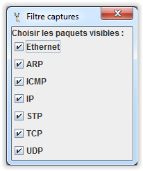
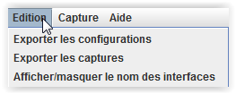

# Interface - Analyse des paquets #

----------

Cette vue contient l'analyse des paquets des interfaces voulues.

Chaque vue des différentes interfaces capture tous les paquets qui passe sur leur interface (que le paquet soit pour l'élément ou non).

Pour chaque paquet on peut voir :

- Temps : Le temps t où le paquet a été vu depuis le démarrage du programme en milli-seconde.
- L'adresse MAC source
- L'adresse MAC de destination
- L'IP source
- L'IP de destination
- Le port source
- Le port de destination
- Le protocole le plus haut
- Le contenu du paquet

Pour ajouter une nouvelle capture à une interface, on clique droit sur l'élément et on sélectionne l'interface.

Pour supprimer la capture on double-clique sur l'onglet.

Pour filtrer les paquets: menu captures->filtre.

Pour exporter les captures au format csv: menu edition->Exporter les captures.

[Retour](index.md)