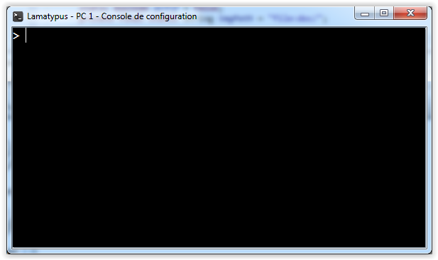
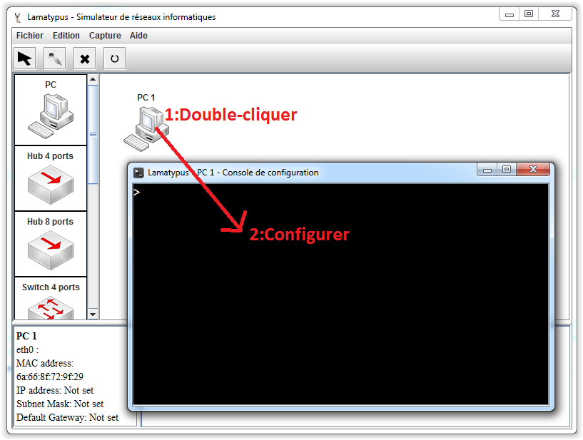

# Console de configuration #
----------

La console de configuration permet d'interagir avec les éléments.

Les éléments qui possèdent une console sont:

- Le [PC](pc.md)
- Le [Serveur](serveur.md)
- Le [Routeur](routeur.md) 

La console offre différentes fonctions suivant le type d'élément.
Elle peut:

- Configurer l'élément
- Lancer une application
- Gérer des services
- Editer des configurations de services

Se référer sur l'aide des éléments pour voir leur set de commande disponible.

La console implémente un historique des commandes utilisées. Utiliser les flèches haut-bas pour se balader dans l'historique.

## Info pratique ##

Lorsqu'une application s’exécute, on peut l'arrêter avec Ctrl-C.

Lorsqu'on configure un service, on peut sortir de l'édition de texte avec Ctrl-X.

Pour ouvrir une console : double-cliquer sur l'élément.

Sur les consoles des routeurs, les commandes raccourcies ne posant pas de problème d’ambiguïté sont correctement interprétée. Par exemple "conf t" à la place de "configure terminal" sera compris tandis que "enn" ne correspondra pas avec "enable".

Sur les consoles des PCs, les commandes comportant des erreurs de syntaxe sont signalées et un algorithme essaie de repérer quelle commande était souhaitée et affiche la syntaxe à utiliser dans la console avec le mot clé USAGE.

[Retour](index.md)