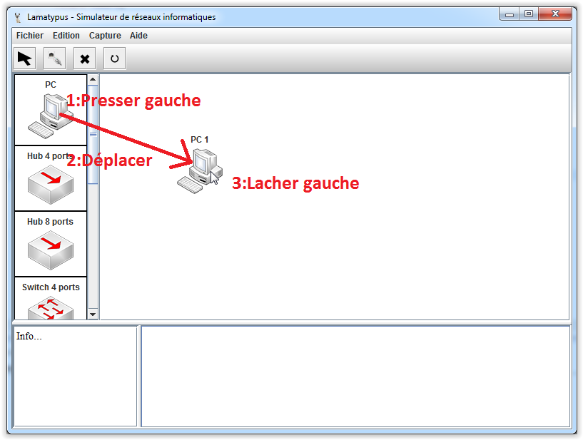

# Interface - Elements #

----------

La fenêtre des éléments contient tous les éléments que l'on peut instancier dans le réseau.

Pour instancier un élément, il suffit de faire un glisser-déposer.

Voici la liste des éléments disponibles :

- [PC](pc.md) 1 port
- [Serveur](serveur.md) 1 port
- [Routeur](routeur.md) 2 ports et 4 ports
- [Switch](switch.md) 4 ports et 8 ports
- [Hub](hub.md) 4 ports et 8 ports

[Retour](index.md)