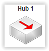

# Elément réseau : Hub #
----------

Le hub est muni de 4 ou 8 interfaces réseau. Elles possèdent toutes des adresses MAC uniques.

Le comportement du hub est simple. Un paquet reçu sur une interface est renvoyé sur toutes les autres.
    
Aucune configuration n'est possible sur cet élément.

[Retour](index.md)