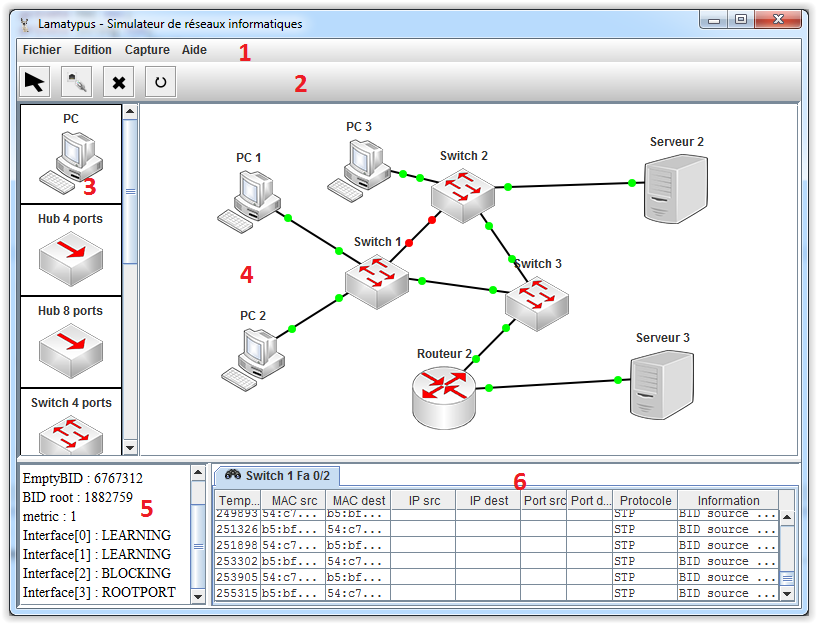

# Manuel Lamatypus #
----------

Simulateur de réseaux informatiques.

## Introduction ##

Ce simulateur a été créé dans le but d'apprendre les bases des réseaux informatiques. On retrouve notamment le routage statique, le routage dynamique, la configuration IP des machines, les connexions  de type TCP/IP UDP/IP. Certain services sont aussi offert, comme le DHCP.

Toute la simulation est interne au programme. Les représentations ne sont que logicielle. On ne reproduit ici que le comportement du réseau et non le réseau lui-même.

Vous partez de zéro? Commencez par [la boîte à outils](outil.md) puis le tutoriel en bas de page !

## Utilisation ##

La fenêtre principale est munie de différentes parties. 

 

- [Le menu principal](menu.md) [1] : Il s'agit du menu fichier, édition et aide. Il permet notamment d'enregistrer le réseau dans un fichier, exporter des informations dans des fichiers texte et d'obtenir de l'aide.
- [La barre d'outils](outil.md) [2] : Elle est utilisée pour changer de mode pour la création du réseau. Le mode sélection, câblage et suppression. On peut aussi reseter le réseau.
- [Les éléments](element.md) [3] : C'est une zone de sélection d'éléments réseaux. On les utilise pour créer le réseau.
- [Le réseau](reseau.md) [4] : C'est une zone de dessin. On peut poser ici les différents éléments et les reliés entre eux.
- [Les informations](info.md) [5] : C'est une zone où les informations d'un élément sont montrées quand il est sélectionné.
- [L'analyse](analyse.md) [6] : C'est une zone où on peut analyser les paquets qui transitent sur les interfaces d’éléments du réseau.
- [La console](console.md) : Les différents éléments configurable possèdent une console. Celle-ci permet plusieurs fonctionnalités suivant le type d'éléments. Chaque élément possède son set de commandes.

## Element à disposition ##

Le programme met à disposition quelques éléments de base pour la création d'un réseau. Chacun a un comportement propre a sa fonction. En voici la liste. Cliquer pour avec une description des possibilités détaillés.

- [PC](pc.md) 1 port
- [Serveur](serveur.md) 1 port
- [Routeur](routeur.md) 2 ports et 4 ports
- [Switch](switch.md) 4 ports et 8 ports
- [Hub](hub.md) 4 ports et 8 ports

## Limitation de la simulation ##

Voici la liste des protocoles simulés dans le logiciel. Ils ne sont pas complet mais assurent une base correct. 

- Ethernet : Protocole de la couche liaison. L'en-tête de paquet ne contient que le type de la couche supérieur, l'adresse MAC de la source et de la destination. 
- ARP : Protocole de la couche liaison. Basé sur ethernet, les requêtes sont formulées via les données du paquet.
- IPv4 : Protocole de la couche réseau. L'en-tête de paquet ne contient que le protocole de la couche supérieur, l'adresse IP source et destination.
- TCP : Protocole de la couche transport. L'en-tête de paquet ne contient que le champ sync (syn, ack, fin), le port source et destination. La retransmission et séquençage de paquet n'est pas supporté.
- UDP : Protocole de la couche transport. L'en-tête ne contient que le port source et destination.
- RIP : Protocole de la couche application pour le routage dynamique.
- STP : Protocole de la couche liaison pour éviter les boucles entre switch. L'en-tête des paquets ne contient que le BIDsource, BIDdestination,BIDroot et metric.
- DHCP : Protocole de la couche application. La réattribution des adresses avec un timeout n'est pas gérée.

## Tutoriel ##

Voici une petite procédure pour se familiariser avec le logiciel.

1. Glisser-Déposer un PC depuis la zone élément à la zone réseau.
- Glisser-Déposer un second PC depuis la zone élément à la zone réseau.
- Cliquer sur l'outil câblage. 
- Cliquer gauche sur le premier PC, sélectionner l'interface eth0. 
- Cliquer gauche sur le deuxième PC, sélectionner l'interface eth0.
- Double-cliquer gauche le premier PC. Cela ouvre la console.
- Tapez la commande: ip addr add 192.168.1.2/24 dev eth0
- Double-cliquer gauche sur le deuxième PC. Cela ouvre une autre console.
- Tapez la commande: ip addr add 192.168.1.3/24 dev eth0
- Cliquer sur l'outil sélection. 
- Cliquer-droit sur le premier PC. Un menu contextuel s'ouvre.
- Aller dans Captures et cliquer sur eth0.
- Retourner dans la console du premier PC.
- Tapez la commande: ping 192.168.1.3
- Vous voyez maintenant apparaître les paquets capturés dans la fenêtre principale.
- Pour arrêter le ping, taper Ctrl-C dans la console.
- Voila vous avez effectué votre premier ping dans Lamatypus!
