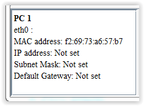
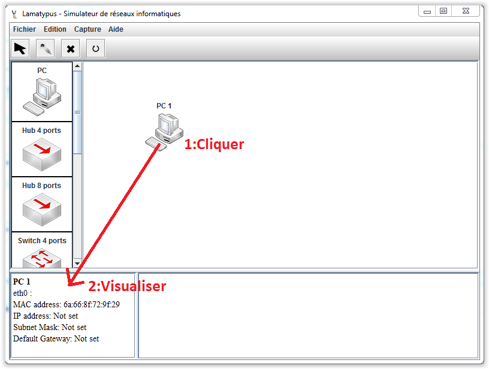

# Interface - Information #

----------

Cette vue contient les informations de configurations d'un élément.

On peut les voir avec un clique-gauche sur un élément.

Les informations des différents éléments du réseau peuvent être sauvées au format HTML grâce au menu Edidion -> Exporter les configurations.

[Retour](index.md)