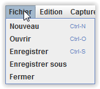
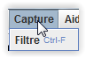
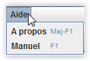

# Interface - Menu principal #

----------

Le menu contient ces différents titres:

- Fichier
- Edition
- Capture
- Aide

## Fichier ##

Le menu fichier contient :

- Nouveau : Permet de réinitialiser tout le réseau.
- Ouvrir : Ouvre un réseau depuis un fichier.
- Enregistrer : Enregistre le réseau en cours sur le fichier courant. Si le fichier courant n'est pas définit, alors enregistrer sous s’exécute.
- Enregistrer sous : Enregistre le réseau courant dans un fichier avec le chemin voulu.
- Fermer : Ferme l'application

Pour tout les menus ci-dessus, si le réseau en cours a été modifié, une proposition de sauvegarde est affichée.

## Edition ##

Le menu édition contient :

- Exporter les configurations : Exporte la configuration de tous les éléments dans un fichier HTML.
- Exporter les captures : Exporte toutes les captures courantes dans un fichier CSV
- Afficher/masquer le nom des interfaces: Permet de choisir ou non d'afficher les noms des différentes interfaces vers leur nœud concerné. Cette option est désactivée par défaut.

## Capture ##

Le menu capture contient :

- Filtre : Permet d'appliquer un filtre sur les paquets des interfaces. Cela offre l'avantage d'être moins dérangé par d'éventuel paquet que l'on ne souhaiterait pas observer.

## Aide ##

Le menu aide contient :

- A propos : Permet de visualiser la version logicielle et autre informations diverses.
- Aide : Permet d'obtenir l'aide utilisateur du logiciel.

[Retour](index.md)