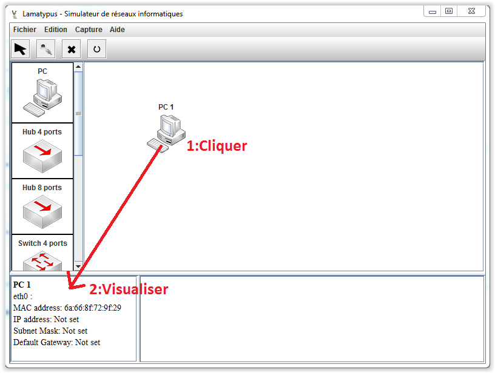
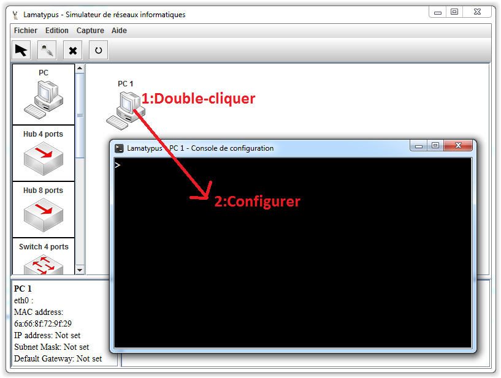
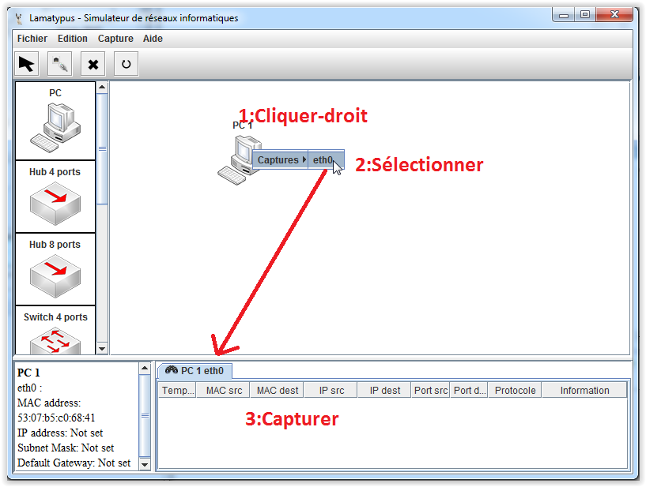
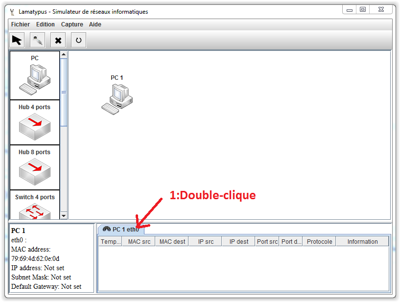

# Interface - Boîte à outils#

----------

La boîte à outils contient quatre outils.

- Sélection
- Câbler
- Supprimer
- Reset

## Sélection ##
La sélection est le mode par défaut.

Il permet de déposer un nouvel élément dans le réseau, grâce à un glisser-déposer.

Il permet de déplacer un élément existant dans le réseau, grâce à un glisser-déposer.

Il permet de visualiser les informations de configuration d'un élément en cliquant une fois dessus.

Il permet d'ouvrir une console de configuration en double cliquant sur l'élément.

Il permet d'ouvrir une capture sur une interface avec clique-droit sur l'élément puis sélection de l'interface dans le menu contextuel.

Il permet de supprimer une capture en double-cliquant sur l'onglet voulu.

## Câbler ##
Le mode câbler permet de lier et délier deux interfaces d’éléments entre elles.

Pour lier deux éléments, on clique gauche sur le premier élément et on sélectionne l'interface dans le menu contextuel, puis on répète l'opération sur le deuxième élément.

Pour délier deux éléments, on clique droite sur un des deux éléments et on sélectionne l'interface où l'on souhaite enlever le lien.

## Supprimer ##
Le mode supprimer permet de supprimer certain élément.

Il suffit de cliquer gauche sur l'élément en question. Cela supprime l'élément et tout les liens auquel il est rattaché.

## Reset ##

Le bouton reset permet de supprimer tout le réseau actuel et de réinitialiser tout le programme.

Si une modification a été effectuée, une proposition de sauvegarde est lancée.

[Retour](index.md)