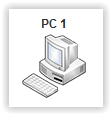

# Elément réseau : PC #
----------

Le PC représente un élément réseau muni d'un terminal pour un utilisateur. Les fonctions de base de configuration IP et les systèmes de test sont disponibles.

Le PC est muni d'une seule interface réseau avec une adresse MAC unique et une adresse IPv4 configurable.
    
## Set de commandes ##

- Configuration	
	- ip addr add x.x.x.x/x dev ethx : ajoute une adresse IP sur une interface.
	- ip addr del dev ethx : supprime l'adresse IP de l'interface
	- ip route add default via x.x.x.x : ajoute une gateway par défaut.
	- ip route del default : supprime la gateway existante.
	- ifconfig : affiche la configuration des interfaces.
- Application
	- ping x.x.x.x : test l'accessibilité à l'adresse distante.
	- ethernet x:x:x:x:x:x : envoie une trame ethernet de test
	- chat client x.x.x.x x : ouvre un terminal de chat sur un serveur avec un port spécifié.
- Service
	- services : liste les services disponibles
	- services start x : active un service
	- services stop x : désactive un service

**Services disponible**

- Client DHCP

[Retour](index.md)