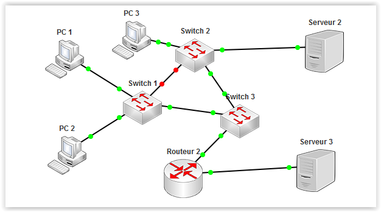

# Interface - Réseau #

----------

Il s'agit de l'espace disponible pour créer un réseau et le simuler. C'est ici que l'on pourra gérer la topologie du réseau et observer si les liens sont actifs ou non grâce aux points vert ou rouge.

Toutes les actions possible dans cette zone sont décrites dans [la boîte à outils](outil.md).

[Retour](index.md)