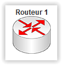

# Elément réseau : Routeur #
----------

Le routeur est muni de 2 ou 4 interfaces réseau. Elles possèdent toutes des adresses MAC uniques et une adresse IPv4 configurable.

Le routeur est muni d'un terminal. Depuis celui-ci, on peut configurer les interfaces réseau, les routes statiques et activer les routes dynamiques (avec RIP).

    
Les commandes du routeur sont exécutables seulement suivant le mode dans lequel on se trouve. Ci-après, on trouve le set de commande du routeur. Chaque niveau représente un mode avec le set de commande correspondant.

## Set de commandes ##

-   Mode normal (par défaut)

    -   enable: Permet de passer en mode administrateur.

        -   configure terminal: Permet de passer en mode de configuration.

            -   hostname xxx: Permet de nommer le routeur.

            -   description xxx: Permet d'ajouter une description du routeur.

            -   router rip: Permet d'activé le protocole de routage RIP.

                -   version 2: Permet d'activé RIPv2.

                -   auto-summary: Active le mode auto-summary

                -   no auto-summary: Désactive le mode auto-summary

                -   network x.x.x.x: Permet d'activé RIP sur le réseau IPv4 donner en paramètre.

                -   no network x.x.x.x: Permet de désactivé RIP sur le réseau IPv4 donner en paramètre.

                -   end: Permet de retourner en mode configuration.

            -   no router rip: Permet de désactivé le protocole de routage RIP.

            -   ip route x.x.x.x m.m.m.m n.n.n.n: Permet de configurer une route statique pour l'adresse IPv4 x.x.x.x avec le masque m.m.m.m sur l'adresse IPv4 de prochain saut n.n.n.n.

            -   no ip route x.x.x.x m.m.m.m i: Permet d'oublier une route statique pour l'adresse IPv4 x.x.x.x avec le masque m.m.m.m sur l'adresse IPv4 de prochain saut n.n.n.n.

            -   interface xxx: Permet de passer en mode configuration d'interface.

                -   ip address x.x.x.x m.m.m.m: Permet de configurer une adresse IPv4 et un masque.

                -   no ip address: Permet d'annuler la configuration de l'adresse IPv4 et du masque.

                -   no shutdown: Permet d'activer l'interface.

                -   shutdown: Permet de désactiver l'interface.

                -   exit: Permet de retourner en mode configuration.

        -   show ip route: Permet d'afficher les routes IPv4.

        -   show ip interface: Permet d'afficher les informations relatives à IPv4 sur les différentes interfaces.

        -   exit: Permet de retourner en mode normal.

    -   show ip route: Permet d'afficher les routes IPv4.

    -   show ip interface: Permet d'afficher les informations relatives à IPv4 sur les différentes interfaces.

[Retour](index.md)