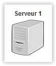

# Elément réseau : Serveur #
----------

Le serveur représente un élément réseau muni d'un terminal pour administrer le serveur. Les fonctions de base de configuration IP et les systèmes de test sont disponibles. De plus certains services serveur sont disponibles.

Le Serveur est muni d'une seul interface réseau avec une adresse MAC unique et une adresse IPv4 configurable.
    
## Set de commandes ##

- Configuration	
	- ip addr add x.x.x.x/x dev ethx : ajoute une adresse IP sur une interface.
	- ip addr del dev ethx : supprime l'adresse IP de l'interface
	- ip route add default via x.x.x.x : ajoute une gateway par défaut.
	- ip route del default : supprime la gateway existante.
	- ifconfig : affiche la configuration des interfaces.
- Application
	- ping x.x.x.x : test l'accessibilité à l'adresse distante.
	- ethernet x:x:x:x:x:x : envoie une trame ethernet de test
	- chat server x : ouvre un serveur de chat sur le port spécifié.
	- help : liste les commandes.
- Service
	- services : liste les services disponibles
	- services start x : active un service
	- services stop x : désactive un service
	- services config x : configurer un service

**Services disponible**

- Client DHCP
- Serveur DHCP

[Retour](index.md)