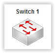

# Elément réseau : Switch #
----------

Le switch est muni de 4 ou 8 interfaces réseau. Elles possèdent toutes des adresses MAC uniques.

Le comportement du switch est simple. Pour chaque paquet reçu, on enregistre la source du paquet et sur quelle interface il a été reçu dans une table CAM.

Si la destination est connue de la table CAM, on envoie le paquet sur l'interface correspondante. Sinon, on l'envoie sur toutes les interfaces.

Le switch implémente aussi le protocole STP. Celui-ci permet d'éviter la formation de boucle si plusieurs switch sont connectés entre eux.
    
Aucune configuration n'est possible sur cet élément.

[Retour](index.md)